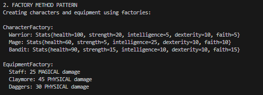
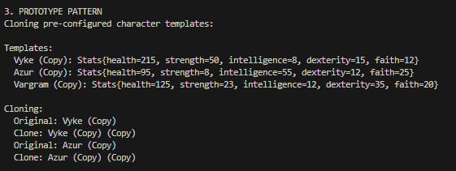

# Creational Design Patterns Lab Report

## Theory

Creational design patterns are solutions that deal with object creation mechanisms. Instead of creating objects directly using constructors, these patterns provide more flexible and reusable ways to instantiate objects. They help us avoid hardcoded dependencies and make the system easier to extend and maintain.

The main creational design patterns include:

- **Singleton** - Ensures only one instance of a class exists
- **Builder** - Constructs complex objects step by step
- **Prototype** - Creates new objects by cloning existing ones
- **Factory Method** - Defines an interface for creating objects, letting subclasses decide which class to instantiate
- **Abstract Factory** - Provides an interface for creating families of related objects

## Objectives

1. Study and understand Creational Design Patterns
2. Choose a domain and define its main classes and entities
3. Implement at least 3 creational design patterns in a sample project

## Implementation

### 1. Builder Pattern

Build complex character objects step-by-step with custom configurations. Creating a character with specific stats, name, and equipment requires many parameters. The Builder pattern lets us construct characters piece by piece in a readable way.

The `CharacterBuilder` class in `factory/builders/CharacterBuilder.java`:

```java
public class CharacterBuilder {
    private String characterType;
    private Stats customStats;
    private List<Object> equipmentList;
    private String name;

    public CharacterBuilder setCharacterType(String type) {
        this.characterType = type;
        return this;
    }

    public CharacterBuilder setName(String name) {
        this.name = name;
        return this;
    }

    public CharacterBuilder setCustomStats(Stats stats) {
        this.customStats = stats;
        return this;
    }

    public CharacterBuilder addWeapon(Weapon weapon) {
        this.equipmentList.add(weapon);
        return this;
    }

    public Character build() {
        // Creates the character based on accumulated configuration
        Character character = createCharacterByType();
        equipAllItems(character);
        return character;
    }
}
```

Each method returns this, allowing us to chain calls together. The `build()` method assembles everything at the end.

**Example**:

```java
Character mage = new CharacterBuilder()
    .setCharacterType("Mage")
    .setName("Sellen")
    .setCustomStats(new Stats(80, 8, 35, 12, 15))
    .addWeapon(EquipmentFactory.createWeapon("staff"))
    .build();
```

This is way cleaner than calling a constructor with 10 parameters. We only set what we need.

**Output**:


Notice how Sellen's intelligence increased from 35 to 50 after equipping the staff, and Bernahl's stats got boosted by the claymore and helm.

---

### 2. Factory Method Pattern

Create objects without specifying their exact class. We don't want the client code to know about every character and equipment class. The factory decides what to instantiate based on a simple string.

The `CharacterFactory` class:

```java
public class CharacterFactory {
    public static Character createCharacter(String type) {
        switch (type.toLowerCase()) {
            case "warrior":
                return new Warrior();
            case "mage":
                return new Mage();
            case "bandit":
                return new Bandit();
            default:
                throw new IllegalArgumentException("Unknown character type: " + type);
        }
    }
}
```

You ask for a "warrior", you get a Warrior object. You don't need to import the Warrior class or know how it is constructed.

The `EquipmentFactory` works the same way:

```java
public class EquipmentFactory {
    public static Weapon createWeapon(String type) {
        switch (type.toLowerCase()) {
            case "daggers":
                return new Daggers();
            case "claymore":
                return new Claymore();
            case "staff":
                return new Staff();
            default:
                throw new IllegalArgumentException("Unknown weapon type: " + type);
        }
    }

    public static Armor createArmor(String type) {
        switch (type.toLowerCase()) {
            case "helm":
                return new Helm();
            case "chestplate":
                return new Chestplate();
            default:
                throw new IllegalArgumentException("Unknown armor type: " + type);
        }
    }
}
```

**Example**:

```java
Character warrior = CharacterFactory.createCharacter("warrior");
Character mage = CharacterFactory.createCharacter("mage");
Weapon staff = EquipmentFactory.createWeapon("staff");
```

**Output**:



Each character comes out with their base stats. Warriors are tanky with high strength, mages are fragile but smart, bandits are balanced.

---

### 3. Prototype Pattern

Create new objects by cloning existing ones. Sometimes we have pre-configured "template" characters and we want to make copies of them quickly without rebuilding everything from scratch.

The `Character` class implements `Cloneable`:

```java
@Override
public Character clone() {
    try {
        Character cloned = (Character) super.clone();
        cloned.baseStats = new Stats(this.baseStats);
        // copy equipment slots (they can share equipment references)
        cloned.equipmentSlots = new HashMap<>(this.equipmentSlots);
        if (this.name != null) {
            cloned.name = this.name + " (Copy)";
        }
        return cloned;
    } catch (CloneNotSupportedException e) {
        throw new RuntimeException("Cloning not supported", e);
    }
}
```

`CharacterPrototypeRegistry` stores pre-made character templates:

```java
public class CharacterPrototypeRegistry {
    private static final Map<String, Character> prototypes = new HashMap<>();

    static {
        prototypes.put("vyke", CharacterTemplates.createEliteWarrior());
        prototypes.put("azur", CharacterTemplates.createArchmage());
        prototypes.put("vargram", CharacterTemplates.createMasterBandit());
    }

    public static Character getPrototype(String key) {
        Character prototype = prototypes.get(key);
        if (prototype == null) {
            throw new IllegalArgumentException("Prototype not found: " + key);
        }
        return prototype.clone();
    }
}
```

The registry holds the original templates. When you ask for a prototype, it clones it and gives you the copy.

**The Templates**:

`CharacterTemplates` creates preconfigured characters:

```java
public static Character createEliteWarrior() {
    Stats eliteStats = new Stats(150, 35, 8, 15, 12);
    Character warrior = new Warrior(eliteStats, "Vyke");
    
    warrior.equipWeapon(EquipmentFactory.createWeapon("claymore"));
    warrior.equipHelmet(EquipmentFactory.createArmor("helm"));
    warrior.equipChestArmor(EquipmentFactory.createArmor("chestplate"));
    
    return warrior;
}
```

Vyke is a legendary warrior with boosted stats and full equipment.

**Usage Example**:

```java
Character vyke = CharacterPrototypeRegistry.getPrototype("vyke");
Character clone1 = vyke.clone();

System.out.println("Original: " + vyke.getName());     // Output: Vyke
System.out.println("Clone: " + clone1.getName());       // Output: Vyke (Copy)
```

**Output**:



Notice how the templates have much higher stats than base characters because they come fully equipped. Vyke has 195 health compared to a basic warrior's 100.

---

## Conclusion

