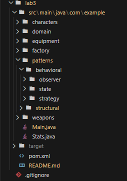

# Structural Design Patterns Lab Report

## Theory

Structural design patterns are solutions that deal with the composition of classes and objects. They help us organize classes and objects into larger structures while keeping the system flexible and efficient. These patterns focus on how classes and objects are composed to form larger structures.

The main structural design patterns include:

- **Adapter** - Allows incompatible interfaces to work together
- **Bridge** - Separates abstraction from implementation
- **Composite** - Treats individual objects and compositions uniformly
- **Decorator** - Adds responsibilities to objects dynamically
- **Facade** - Provides a simplified interface to a complex subsystem
- **Flyweight** - Shares objects to support large numbers efficiently
- **Proxy** - Provides a placeholder for another object

## Objectives

1. Study and understand Structural Design Patterns
2. Choose a domain and define its main classes and entities
3. Implement at least 3 structural design patterns in a sample project

## Implementation

### 1. Decorator Pattern

Add responsibilities to objects dynamically. We want to enhance weapons with enchantments and upgrades without changing their core behavior. The Decorator pattern lets us wrap weapons with additional features like bonus damage or stat boosts.

The `WeaponDecorator` abstract class in `patterns/decorator/WeaponDecorator.java`:

```java
public abstract class WeaponDecorator implements Weapon {
    protected Weapon weapon;

    public WeaponDecorator(Weapon weapon) {
        this.weapon = weapon;
    }

    @Override
    public void apply(Stats stats) {
        weapon.apply(stats);
    }

    @Override
    public int getDamage() {
        return weapon.getDamage();
    }

    @Override
    public DamageType getDamageType() {
        return weapon.getDamageType();
    }
}
```

Concrete decorators like `FireEnchantment` in `patterns/decorator/FireEnchantment.java`:

```java
public class FireEnchantment extends WeaponDecorator {
    public FireEnchantment(Weapon weapon) {
        super(weapon);
    }

    @Override
    public void apply(Stats stats) {
        super.apply(stats);
        stats.addIntelligence(5);
    }

    @Override
    public int getDamage() {
        return super.getDamage() + 10;
    }

    @Override
    public DamageType getDamageType() {
        return DamageType.FIRE;
    }
}
```

Each decorator adds its own bonuses while delegating to the wrapped weapon.

**Example**:

```java
Weapon daggers = EquipmentFactory.createWeapon("daggers");
Weapon fireDaggers = new FireEnchantment(daggers);
Weapon heavyFireDaggers = new HeavyUpgrade(fireDaggers);
Weapon holyHeavyFireDaggers = new HolyUpgrade(heavyFireDaggers);
```

We can stack multiple decorators to create complex weapon combinations.

**Output**:


Notice how the damage increases with each decorator, and the damage type changes based on the outermost enchantment.

---

### 2. Adapter Pattern

Allow incompatible interfaces to work together. We have an external sword class from a third-party library that doesn't implement our Weapon interface. The Adapter pattern lets us wrap it so it fits into our system.

The external sword in `patterns/adapter/external/ExternalSword.java`:

```java
public class ExternalSword {
    public void buffStats(Stats stats) {
        stats.addStrength(8);
        stats.addDexterity(5);
    }

    public int getAttackPower() {
        return 35;
    }

    public String getElement() {
        return "lightning";
    }
}
```

The adapter in `patterns/adapter/ExternalSwordAdapter.java`:

```java
public class ExternalSwordAdapter implements Weapon {
    private ExternalSword externalSword;

    public ExternalSwordAdapter(ExternalSword externalSword) {
        this.externalSword = externalSword;
    }

    @Override
    public void apply(Stats stats) {
        externalSword.buffStats(stats);
    }

    @Override
    public int getDamage() {
        return externalSword.getAttackPower();
    }

    @Override
    public DamageType getDamageType() {
        String element = externalSword.getElement();
        switch (element) {
            case "lightning":
                return DamageType.MAGICAL;
            default:
                return DamageType.PHYSICAL;
        }
    }
}
```

The adapter translates between the external interface and our Weapon interface.

**Example**:

```java
ExternalSword externalSword = new ExternalSword();
Weapon adaptedSword = new ExternalSwordAdapter(externalSword);
Character warrior = GameFacade.createBasicCharacter("warrior");
warrior.equipWeapon(adaptedSword);
```

The external sword now works seamlessly with our character system.

**Output**:


The adapted sword provides 35 magical damage and boosts strength and dexterity when equipped.

---

### 3. Facade Pattern

Provide a simplified interface to a complex subsystem. Our character creation system involves multiple factories and builders. The Facade pattern gives clients a single, clean interface to access all creation functionality.

The `GameFacade` class in `patterns/facade/GameFacade.java`:

```java
public class GameFacade {
    public static Character createBasicCharacter(String type) {
        return CharacterFactory.createCharacter(type);
    }

    public static Character createFromPrototype(String key) {
        return CharacterPrototypeRegistry.getPrototype(key);
    }

    public static Character buildCustomCharacter(String type, String name, Stats stats, String weaponType, String armorType) {
        CharacterBuilder builder = new CharacterBuilder()
            .setCharacterType(type)
            .setName(name)
            .setCustomStats(stats);

        if (weaponType != null) {
            Weapon weapon = EquipmentFactory.createWeapon(weaponType);
            builder.addWeapon(weapon);
        }

        if (armorType != null) {
            Armor armor = EquipmentFactory.createArmor(armorType);
            builder.addArmor(armor);
        }

        return builder.build();
    }
}
```

The facade hides the complexity of coordinating between factories, builders, and registries.

**Example**:

```java
Character basicWarrior = GameFacade.createBasicCharacter("warrior");
Character prototypeMage = GameFacade.createFromPrototype("azur");
Character customBandit = GameFacade.buildCustomCharacter("bandit", "Rogue", new Stats(110, 15, 10, 20, 15), "daggers", "helm");
```

Clients don't need to know about the underlying factories or builders.

**Output**:



The facade provides three different ways to create characters with a simple, unified interface.

---

## Conclusion

The implementation of structural design patterns significantly enhanced the modularity and extensibility of a system. The Decorator pattern provided dynamic composition of weapon enhancements, allowing runtime addition of responsibilities such as damage bonuses and stat modifications without altering core weapon classes. This pattern's recursive composition enabled stacking multiple enchantments (FireEnchantment + HeavyUpgrade) while maintaining the Open-Closed Principle. By implementing object composition and interface translation, the ExternalSwordAdapter successfully mapped buffStats() to apply(), getAttackPower() to getDamage(), and element strings to DamageType enums, ensuring seamless interoperability.

GameFacade encapsulated interactions between CharacterFactory, CharacterBuilder, EquipmentFactory, and CharacterPrototypeRegistry, reducing client coupling and improving maintainability. This abstraction layer allowed clients to perform complex operations like buildCustomCharacter() through simple method calls.

However, the current implementation lacks the remaining structural patterns: Bridge, Composite, Flyweight, and Proxy. For Bridge, we could separate weapon abstraction from implementation by creating a WeaponAbstraction class that delegates to WeaponImpl interfaces, allowing independent variation of weapon types and behaviors. For Composite, a CharacterGroup class could treat individual characters and groups uniformly for party management. Flyweight could optimize equipment sharing by maintaining a pool of immutable equipment instances. Proxy could add lazy loading for character stats or caching for prototype retrieval. These patterns would further enhance the system's flexibility and performance, bt we just did not do it (.
